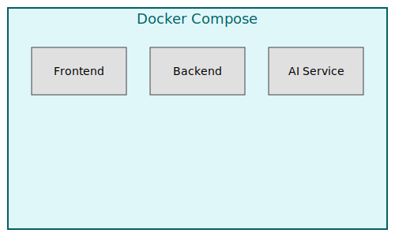

# PSScript Manager


PSScript Manager is an **AI-powered** platform for managing and analyzing PowerShell scripts.
It bundles a collection of Docker services to help you explore, categorize and search scripts with the help of language models.

## Table of Contents
- [Features](#features)
- [Architecture](#architecture)
- [Quick Start](#quick-start)
- [Project Structure](#project-structure)
- [Updating](#updating)
- [Contributing](#contributing)
- [License](#license)

## Features
- Script management and categorization
- AI‑powered analysis of scripts
- Search and discovery backed by a vector database
- Multi‑agent system (planned)
- Documentation integration
- User authentication
- Built-in dashboard for analyzing scripts

## Architecture

A simplified view of the container layout.



## Quick Start
1. Clone the repository:
   ```bash
   git clone https://github.com/YOUR_USERNAME/psscript-manager.git
   cd psscript-manager
   ```
2. Run the helper script (choose `dev` or `prod`):
   ```bash
   ./setup-check.sh dev
   ```
   The script checks prerequisites, creates a `.env` file if needed and launches the containers.
3. Access the dashboard at `http://localhost:5000/dashboard` once the stack is running.
   The placeholder React frontend is still available at `http://localhost:5173`.
   A basic statistics endpoint is available at `http://localhost:5000/stats`.

Logs for the AI service are written to the path specified by `LOG_FILE` in your `.env` file (default `./logs/app.log`).

You can also send requests directly to the AI `/analyze` endpoint:

```bash
curl -X POST http://localhost:5000/analyze \
     -H "Content-Type: application/json" \
     -d '{"script": "Get-Process"}'
```

The response includes a summary, key cmdlets with definitions and examples, and links to related Microsoft Learn articles when available.

### Configuring OpenAI

Use the `scripts/openai_config.py` helper to set your OpenAI API key and choose the model. The script updates your `.env` file:

```bash
python scripts/openai_config.py
```

The tool will prompt for your API key, query available models and let you select one to store in `.env` as `OPENAI_MODEL`.

## Project Structure
- `docker-compose.yml` & `docker-compose.override.yml` – container configuration
- `docker-start.sh` – manual script to start containers
- `make-executable.sh` – sets execute permissions on helper scripts
- `setup-check.sh` – verifies prerequisites and starts the stack
- `update-app.sh` – pulls the latest code and rebuilds containers
- `src/ai` – Python AI service
- `src/backend` – Node.js API (placeholder)
- `src/frontend` – React frontend (placeholder)

## Updating
To fetch the latest code and rebuild the containers, run:
```bash
./update-app.sh dev   # or 'prod'
```

## Contributing
See [CONTRIBUTING.md](CONTRIBUTING.md) for guidelines.

## License
This project is licensed under the MIT License. See [LICENSE](LICENSE) for details.

## Acknowledgments
- [LangChain](https://github.com/langchain-ai/langchain)
- [LangGraph](https://github.com/langchain-ai/langgraph)
- [pgvector](https://github.com/pgvector/pgvector)
- [React](https://reactjs.org/)
- [Express](https://expressjs.com/)
- [TypeScript](https://www.typescriptlang.org/)
