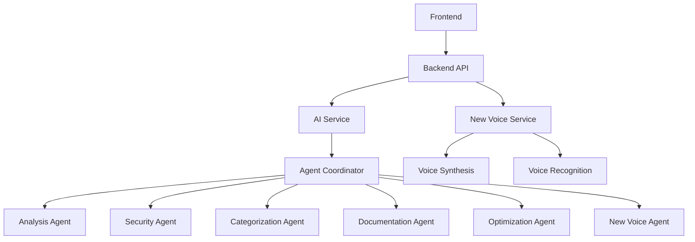

# Voice API Integration Plan

## Overview

This document outlines the detailed implementation plan for integrating Voice API capabilities into the PSScript Manager platform. The integration will enhance the platform with interactive voice capabilities, aligning with the app's mission of leveraging cutting-edge AI technologies.

## Current Architecture Analysis

### Strengths
- **Modular Design**: The platform has a clear separation between frontend, backend, AI service, and database components.
- **Agent-Based Architecture**: The AI service uses a well-structured agent coordinator that orchestrates specialized agents for different tasks.
- **Extensible API**: The backend provides a clean API structure that can be extended for new capabilities.
- **Containerization**: Docker support makes deployment and scaling straightforward.

### Areas for Improvement
- **Tight Coupling**: Some components have tight coupling that could be refactored for better maintainability.
- **Error Handling**: Error handling is inconsistent across different modules.
- **Documentation**: Integration points between components could be better documented.

## Voice API Integration Architecture

The Voice API integration will follow a microservices approach, adding a new Voice Service component that will interact with the existing AI service and backend.



## Phased Implementation Plan

### Phase 1: Voice Service Foundation (Weeks 1-2)

#### 1.1 Create Voice Service Agent
- Add a new Voice Agent to the agent coordinator in the AI service
- Implement basic voice-related capabilities
- Define the agent's role and responsibilities

```python
# Example implementation in src/ai/agents/agent_coordinator.py

# Add to _create_specialized_agents method
voice_agent_id = self.multi_agent_system.add_agent(
    name="Voice Agent",
    role=AgentRole.INTERFACE,
    capabilities=[
        AgentCapability.VOICE_SYNTHESIS,
        AgentCapability.VOICE_RECOGNITION,
        AgentCapability.TOOL_USE
    ],
    api_key=self.api_key,
    model=model
)
```

#### 1.2 Add Voice Capabilities to Agent Capabilities Enum
- Update the AgentCapability enum to include voice-related capabilities

```python
# Example implementation in src/ai/agents/multi_agent_system.py

class AgentCapability(Enum):
    # Existing capabilities
    SCRIPT_ANALYSIS = "script_analysis"
    SECURITY_ANALYSIS = "security_analysis"
    CATEGORIZATION = "categorization"
    DOCUMENTATION = "documentation"
    OPTIMIZATION = "optimization"
    CODE_GENERATION = "code_generation"
    REASONING = "reasoning"
    MEMORY_MANAGEMENT = "memory_management"
    TOOL_USE = "tool_use"
    
    # New voice capabilities
    VOICE_SYNTHESIS = "voice_synthesis"
    VOICE_RECOGNITION = "voice_recognition"
```

#### 1.3 Create Voice Service API Endpoints
- Add new endpoints to the AI service for voice synthesis and recognition

```python
# Example implementation in src/ai/main.py

class VoiceSynthesisRequest(BaseModel):
    text: str = Field(..., description="Text to synthesize into speech")
    voice_id: Optional[str] = Field(None, description="Voice ID to use")
    output_format: str = Field("mp3", description="Output audio format")

class VoiceRecognitionRequest(BaseModel):
    audio_data: str = Field(..., description="Base64-encoded audio data")
    language: str = Field("en-US", description="Language code")

@app.post("/voice/synthesize", tags=["Voice"])
async def synthesize_speech(
    request: VoiceSynthesisRequest,
    api_key: Optional[str] = Header(None, alias="x-api-key")
):
    """
    Synthesize text into speech.
    
    - api_key: Optional OpenAI API key to use for this request
    """
    try:
        # Use the agent coordinator if available
        if agent_coordinator and not MOCK_MODE:
            synthesis_result = await agent_coordinator.synthesize_speech(
                text=request.text,
                voice_id=request.voice_id,
                output_format=request.output_format
            )
            return synthesis_result
        else:
            # Fall back to the legacy agent system
            raise HTTPException(status_code=501, detail="Voice synthesis not implemented in legacy mode")
    
    except Exception as e:
        raise HTTPException(status_code=500, detail=f"Speech synthesis failed: {str(e)}")

@app.post("/voice/recognize", tags=["Voice"])
async def recognize_speech(
    request: VoiceRecognitionRequest,
    api_key: Optional[str] = Header(None, alias="x-api-key")
):
    """
    Recognize speech from audio data.
    
    - api_key: Optional OpenAI API key to use for this request
    """
    try:
        # Use the agent coordinator if available
        if agent_coordinator and not MOCK_MODE:
            recognition_result = await agent_coordinator.recognize_speech(
                audio_data=request.audio_data,
                language=request.language
            )
            return recognition_result
        else:
            # Fall back to the legacy agent system
            raise HTTPException(status_code=501, detail="Voice recognition not implemented in legacy mode")
    
    except Exception as e:
        raise HTTPException(status_code=500, detail=f"Speech recognition failed: {str(e)}")
```

#### 1.4 Implement Voice Agent Methods in Agent Coordinator
- Add methods to the AgentCoordinator class for voice synthesis and recognition

```python
# Example implementation in src/ai/agents/agent_coordinator.py

async def synthesize_speech(
    self,
    text: str,
    voice_id: Optional[str] = None,
    output_format: str = "mp3"
) -> Dict[str, Any]:
    """
    Synthesize text into speech using the voice agent.
    
    Args:
        text: Text to synthesize
        voice_id: Voice ID to use
        output_format: Output audio format
        
    Returns:
        Dictionary containing the audio data and metadata
    """
    # Use the tool registry to execute the voice synthesis tool
    synthesis_result = await tool_registry.execute_tool(
        tool_name="voice_synthesis",
        args={
            "text": text,
            "voice_id": voice_id,
            "output_format": output_format
        },
        use_cache=True,
        api_key=self.api_key
    )
    
    if synthesis_result["success"]:
        # Add to working memory
        self.memory_system.add_to_working_memory(
            content={"text": text, "voice_id": voice_id},
            memory_type="voice_synthesis",
            source="voice_agent",
            importance=0.6
        )
        
        return synthesis_result["result"]
    else:
        logger.error(f"Voice synthesis failed: {synthesis_result.get('error')}")
        return {"error": synthesis_result.get("error", "Unknown error")}

async def recognize_speech(
    self,
    audio_data: str,
    language: str = "en-US"
) -> Dict[str, Any]:
    """
    Recognize speech from audio data using the voice agent.
    
    Args:
        audio_data: Base64-encoded audio data
        language: Language code
        
    Returns:
        Dictionary containing the recognized text and metadata
    """
    # Use the tool registry to execute the voice recognition tool
    recognition_result = await tool_registry.execute_tool(
        tool_name="voice_recognition",
        args={
            "audio_data": audio_data,
            "language": language
        },
        use_cache=False,  # Don't cache recognition results
        api_key=self.api_key
    )
    
    if recognition_result["success"]:
        # Add to working memory
        self.memory_system.add_to_working_memory(
            content={"recognized_text": recognition_result["result"]["text"]},
            memory_type="voice_recognition",
            source="voice_agent",
            importance=0.7
        )
        
        return recognition_result["result"]
    else:
        logger.error(f"Voice recognition failed: {recognition_result.get('error')}")
        return {"error": recognition_result.get("error", "Unknown error")}
```

### Phase 2: Backend Integration (Weeks 3-4)

#### 2.1 Create Voice Controller in Backend
- Add a new VoiceController to handle voice-related requests

```typescript
// Example implementation in src/backend/src/controllers/VoiceController.ts

import { Request, Response } from 'express';
import axios from 'axios';
import logger from '../utils/logger';

/**
 * Voice Controller
 * Handles voice interactions with the AI service
 */
export class VoiceController {
  private aiServiceUrl: string;
  
  constructor() {
    // Get AI service URL from environment variables or use default
    const isDocker = process.env.DOCKER_ENV === 'true';
    this.aiServiceUrl = isDocker 
      ? (process.env.AI_SERVICE_URL || 'http://ai-service:8000') 
      : (process.env.AI_SERVICE_URL || 'http://localhost:8000');
    logger.info(`VoiceController initialized with AI service URL: ${this.aiServiceUrl}`);
  }
  
  /**
   * Synthesize text into speech
   * @param req Request object containing text to synthesize
   * @param res Response object
   */
  public async synthesizeSpeech(req: Request, res: Response): Promise<void> {
    const requestId = Math.random().toString(36).substring(2, 10);
    
    try {
      const { text, voice_id, output_format } = req.body;
      
      // Validate request parameters
      if (!text || typeof text !== 'string' || text.trim().length === 0) {
        logger.warn(`[${requestId}] Invalid request: Missing or empty text`);
        res.status(400).json({ error: 'Text is required and must not be empty' });
        return;
      }
      
      // Use server API key if one is not provided by the client
      const apiKey = req.headers['x-api-key'] || process.env.OPENAI_API_KEY;
      
      if (!apiKey) {
        logger.warn(`[${requestId}] Invalid request: No API key provided and no server API key configured`);
        res.status(400).json({ error: 'API key is required' });
        return;
      }
      
      // Forward request to AI service
      logger.debug(`[${requestId}] Sending voice synthesis request to ${this.aiServiceUrl}/voice/synthesize`);
      
      const response = await axios.post(`${this.aiServiceUrl}/voice/synthesize`, {
        text,
        voice_id,
        output_format: output_format || 'mp3'
      }, {
        headers: {
          'Content-Type': 'application/json',
          'X-API-Key': apiKey,
          'X-Request-ID': requestId
        },
        timeout: 30000 // 30 second timeout
      });
      
      res.status(200).json(response.data);
    } catch (error) {
      logger.error(`[${requestId}] Error in synthesizeSpeech:`, error);
      
      if (axios.isAxiosError(error)) {
        if (error.code === 'ECONNABORTED') {
          res.status(504).json({ 
            error: 'Request timeout',
            details: 'The AI service took too long to respond'
          });
        } else if (!error.response) {
          res.status(503).json({ 
            error: 'AI service unavailable',
            details: 'Could not connect to the AI service'
          });
        } else {
          res.status(error.response.status).json({ 
            error: 'AI service error',
            details: error.response.data?.message || error.message,
            status: error.response.status
          });
        }
      } else {
        res.status(500).json({ 
          error: 'Failed to synthesize speech',
          details: error instanceof Error ? error.message : String(error),
          requestId: requestId
        });
      }
    }
  }
  
  /**
   * Recognize speech from audio data
   * @param req Request object containing audio data
   * @param res Response object
   */
  public async recognizeSpeech(req: Request, res: Response): Promise<void> {
    const requestId = Math.random().toString(36).substring(2, 10);
    
    try {
      const { audio_data, language } = req.body;
      
      // Validate request parameters
      if (!audio_data || typeof audio_data !== 'string' || audio_data.trim().length === 0) {
        logger.warn(`[${requestId}] Invalid request: Missing or empty audio data`);
        res.status(400).json({ error: 'Audio data is required and must not be empty' });
        return;
      }
      
      // Use server API key if one is not provided by the client
      const apiKey = req.headers['x-api-key'] || process.env.OPENAI_API_KEY;
      
      if (!apiKey) {
        logger.warn(`[${requestId}] Invalid request: No API key provided and no server API key configured`);
        res.status(400).json({ error: 'API key is required' });
        return;
      }
      
      // Forward request to AI service
      logger.debug(`[${requestId}] Sending voice recognition request to ${this.aiServiceUrl}/voice/recognize`);
      
      const response = await axios.post(`${this.aiServiceUrl}/voice/recognize`, {
        audio_data,
        language: language || 'en-US'
      }, {
        headers: {
          'Content-Type': 'application/json',
          'X-API-Key': apiKey,
          'X-Request-ID': requestId
        },
        timeout: 30000 // 30 second timeout
      });
      
      res.status(200).json(response.data);
    } catch (error) {
      logger.error(`[${requestId}] Error in recognizeSpeech:`, error);
      
      if (axios.isAxiosError(error)) {
        if (error.code === 'ECONNABORTED') {
          res.status(504).json({ 
            error: 'Request timeout',
            details: 'The AI service took too long to respond'
          });
        } else if (!error.response) {
          res.status(503).json({ 
            error: 'AI service unavailable',
            details: 'Could not connect to the AI service'
          });
        } else {
          res.status(error.response.status).json({ 
            error: 'AI service error',
            details: error.response.data?.message || error.message,
            status: error.response.status
          });
        }
      } else {
        res.status(500).json({ 
          error: 'Failed to recognize speech',
          details: error instanceof Error ? error.message : String(error),
          requestId: requestId
        });
      }
    }
  }
}
```

#### 2.2 Create Voice Routes in Backend
- Add new routes for voice-related endpoints

```typescript
// Example implementation in src/backend/src/routes/voice.ts

import express from 'express';
import { VoiceController } from '../controllers/VoiceController';
import { authenticateJWT } from '../middleware/authMiddleware';

const router = express.Router();
const voiceController = new VoiceController();

/**
 * @swagger
 * tags:
 *   name: Voice
 *   description: Voice operations
 */

/**
 * @swagger
 * /voice/synthesize:
 *   post:
 *     summary: Synthesize text into speech
 *     tags: [Voice]
 *     requestBody:
 *       required: true
 *       content:
 *         application/json:
 *           schema:
 *             type: object
 *             required:
 *               - text
 *             properties:
 *               text:
 *                 type: string
 *               voice_id:
 *                 type: string
 *               output_format:
 *                 type: string
 *                 enum: [mp3, wav, ogg]
 *                 default: mp3
 *     responses:
 *       200:
 *         description: Speech synthesized successfully
 *       400:
 *         description: Invalid request
 *       500:
 *         description: Server error
 */
router.post('/synthesize', voiceController.synthesizeSpeech.bind(voiceController));

/**
 * @swagger
 * /voice/recognize:
 *   post:
 *     summary: Recognize speech from audio data
 *     tags: [Voice]
 *     requestBody:
 *       required: true
 *       content:
 *         application/json:
 *           schema:
 *             type: object
 *             required:
 *               - audio_data
 *             properties:
 *               audio_data:
 *                 type: string
 *                 description: Base64-encoded audio data
 *               language:
 *                 type: string
 *                 default: en-US
 *     responses:
 *       200:
 *         description: Speech recognized successfully
 *       400:
 *         description: Invalid request
 *       500:
 *         description: Server error
 */
router.post('/recognize', voiceController.recognizeSpeech.bind(voiceController));

export default router;
```

#### 2.3 Register Voice Routes in Backend
- Update the main backend index.js file to include the new voice routes

```typescript
// Example update to src/backend/index.js or src/backend/src/index.ts

// Import the voice routes
import voiceRoutes from './routes/voice';

// Register the voice routes
app.use('/api/voice', voiceRoutes);
```

#### 2.4 Update Chat Controller to Support Voice Interactions
- Extend the ChatController to support voice input and output

```typescript
// Example update to src/backend/src/controllers/ChatController.ts

// Add to the sendMessage method
public async sendMessage(req: Request, res: Response): Promise<void> {
  // ... existing code ...
  
  try {
    const { messages, system_prompt, api_key, agent_type, session_id, voice_response } = req.body;
    
    // ... existing validation code ...
    
    // Forward request to AI service with voice_response flag
    const response = await axios.post(`${this.aiServiceUrl}/chat`, {
      messages,
      system_prompt,
      api_key: effectiveApiKey,
      agent_type,
      session_id,
      voice_response // Pass the voice_response flag to the AI service
    }, {
      headers: {
        'Content-Type': 'application/json',
        'X-Request-ID': requestId
      },
      timeout: 60000 // 60 second timeout for LLM responses
    });
    
    // If voice response is requested, synthesize the response
    if (voice_response && response.data && response.data.response) {
      try {
        const voiceResponse = await axios.post(`${this.aiServiceUrl}/voice/synthesize`, {
          text: response.data.response,
          voice_id: req.body.voice_id, // Optional voice ID
          output_format: req.body.output_format || 'mp3' // Default to mp3
        }, {
          headers: {
            'Content-Type': 'application/json',
            'X-API-Key': effectiveApiKey,
            'X-Request-ID': requestId
          },
          timeout: 30000 // 30 second timeout
        });
        
        // Add voice data to the response
        response.data.voice_data = voiceResponse.data.audio_data;
        response.data.voice_format = voiceResponse.data.format;
      } catch (voiceError) {
        logger.error(`[${requestId}] Error synthesizing voice response:`, voiceError);
        // Continue without voice response if synthesis fails
      }
    }
    
    // ... rest of the existing code ...
  } catch (error) {
    // ... existing error handling ...
  }
}
```

### Phase 3: Voice Tool Integration (Weeks 5-6)

#### 3.1 Implement Voice Synthesis Tool
- Create a new tool for voice synthesis in the AI service

```python
# Example implementation in src/ai/agents/tool_integration.py

@tool_registry.register_tool
async def voice_synthesis(text: str, voice_id: Optional[str] = None, output_format: str = "mp3") -> Dict[str, Any]:
    """
    Synthesize text into speech.
    
    Args:
        text: Text to synthesize
        voice_id: Voice ID to use
        output_format: Output audio format
        
    Returns:
        Dictionary containing the audio data and metadata
    """
    try:
        # Validate input
        if not text or not isinstance(text, str) or len(text.strip()) == 0:
            return {
                "success": False,
                "error": "Text is required and must not be empty"
            }
        
        # Truncate text if it's too long
        max_length = 5000  # Most TTS services have limits
        if len(text) > max_length:
            logger.warning(f"Text too long for voice synthesis, truncating from {len(text)} to {max_length} characters")
            text = text[:max_length]
        
        # Use a TTS service to synthesize speech
        # This is a placeholder - replace with actual TTS service integration
        # For example, using Google Cloud Text-to-Speech:
        
        from google.cloud import texttospeech
        
        # Instantiate a client
        client = texttospeech.TextToSpeechClient()
        
        # Set the text input to be synthesized
        synthesis_input = texttospeech.SynthesisInput(text=text)
        
        # Build the voice request
        if voice_id:
            # Parse voice_id format (e.g., "en-US-Standard-A")
            parts = voice_id.split("-")
            if len(parts) >= 3:
                language_code = f"{parts[0]}-{parts[1]}"
                voice_name = "-".join(parts[2:])
            else:
                language_code = "en-US"
                voice_name = "Standard-A"
        else:
            language_code = "en-US"
            voice_name = "Standard-A"
        
        # Select the type of audio file to return
        if output_format.lower() == "mp3":
            audio_encoding = texttospeech.AudioEncoding.MP3
        elif output_format.lower() == "wav":
            audio_encoding = texttospeech.AudioEncoding.LINEAR16
        elif output_format.lower() == "ogg":
            audio_encoding = texttospeech.AudioEncoding.OGG_OPUS
        else:
            audio_encoding = texttospeech.AudioEncoding.MP3
        
        voice = texttospeech.VoiceSelectionParams(
            language_code=language_code,
            name=f"{language_code}-{voice_name}"
        )
        
        audio_config = texttospeech.AudioConfig(
            audio_encoding=audio_encoding
        )
        
        # Perform the text-to-speech request
        response = client.synthesize_speech(
            input=synthesis_input,
            voice=voice,
            audio_config=audio_config
        )
        
        # Return the audio content as base64-encoded string
        import base64
        audio_data = base64.b64encode(response.audio_content).decode("utf-8")
        
        return {
            "success": True,
            "result": {
                "audio_data": audio_data,
                "format": output_format.lower(),
                "duration": len(response.audio_content) / 16000,  # Approximate duration in seconds
                "text": text
            }
        }
    except Exception as e:
        logger.error(f"Error in voice_synthesis tool: {e}")
        return {
            "success": False,
            "error": str(e)
        }
```

#### 3.2 Implement Voice Recognition Tool
- Create a new tool for voice recognition in the AI service

```python
# Example implementation in src/ai/agents/tool_integration.py

@tool_registry.register_tool
async def voice_recognition(audio_data: str, language: str = "en-US") -> Dict[str, Any]:
    """
    Recognize speech from audio data.
    
    Args:
        audio_data: Base64-encoded audio data
        language: Language code
        
    Returns:
        Dictionary containing the recognized text and metadata
    """
    try:
        # Validate input
        if not audio_data or not isinstance(audio_data, str) or len(audio_data.strip()) == 0:
            return {
                "success": False,
                "error": "Audio data is required and must not be empty"
            }
        
        # Decode base64 audio data
        import base64
        try:
            decoded_audio = base64.b64decode(audio_data)
        except Exception as e:
            return {
                "success": False,
                "error": f"Invalid base64-encoded audio data: {str(e)}"
            }
        
        # Use a speech recognition service to recognize speech
        # This is a placeholder - replace with actual speech recognition service integration
        # For example, using Google Cloud Speech-to-Text:
        
        from google.cloud import speech
        
        # Instantiate a client
        client = speech.SpeechClient()
        
        # Configure the request
        config = speech.RecognitionConfig(
            encoding=speech.RecognitionConfig.AudioEncoding.LINEAR16,
            sample_rate_hertz=16000,
            language_code=language
        )
        
        # Create an audio object
        audio = speech.RecognitionAudio(content=decoded_audio)
        
        # Perform the speech recognition
        response = client.recognize(config=config, audio=audio)
        
        # Process the response
        results = []
        for result in response.results:
            for alternative in result.alternatives:
                results.append({
                    "text": alternative.transcript,
                    "confidence": alternative.confidence
                })
        
        # Return the recognized text
        if results:
            return {
                "success": True,
                "result": {
                    "text": results[0]["text"],
                    "confidence": results[0]["confidence"],
                    "alternatives": results[1:] if len(results) > 1 else []
                }
            }
        else:
            return {
                "success": False,
                "error": "No speech recognized"
            }
    except Exception as e:
        logger.error(f"Error in voice_recognition tool: {e}")
        return {
            "success": False,
            "error": str(e)
        }
```

### Phase 4: Frontend Integration (Weeks 7-8)

#### 4.1 Create Voice Components
- Implement frontend components for voice interactions

#### 4.2 Integrate Voice Components with Chat Interface
- Update the chat interface to support voice input and output

#### 4.3 Add Voice Settings
- Add settings for voice preferences (voice type, language, etc.)

### Phase 5: Testing and Optimization (Weeks 9-10)

#### 5.1 Unit Testing
- Write unit tests for voice-related functionality

#### 5.2 Integration Testing
- Test the integration of voice capabilities with the existing system

#### 5.3 Performance Optimization
- Optimize voice processing for better performance

#### 5.4 User Acceptance Testing
- Gather feedback from users and make improvements

## Implementation Considerations

### API Selection
- Consider using established voice APIs such as Google Cloud Text-to-Speech/Speech-to-Text, Amazon Polly/Transcribe, or Microsoft Azure Cognitive Services.
- Evaluate factors such as cost, quality, language support, and latency.

### Security Considerations
- Ensure that voice data is transmitted securely.
- Implement proper authentication and authorization for voice endpoints.
- Consider privacy implications of storing voice data.

### Performance Optimization
- Implement caching for frequently used voice responses.
- Consider streaming audio for better user experience.
- Optimize audio formats and quality for different use cases.

### Error Handling
- Implement robust error handling for voice processing failures.
- Provide fallback mechanisms when voice processing is unavailable.

## Future Enhancements

1. **Voice Authentication**: Add voice biometric authentication for enhanced security.
2. **Voice Commands**: Implement custom voice commands for common actions.
3. **Multi-language Support**: Expand voice capabilities to support multiple languages.
4. **Voice Customization**: Allow users to customize voice parameters (pitch, speed, etc.).
5. **Voice Analytics**: Add analytics to track voice usage and performance.

## Conclusion

This implementation plan provides a comprehensive approach to integrating Voice API capabilities into the PSScript Manager platform. By following this phased approach, we can ensure a smooth integration that enhances the platform's capabilities while maintaining its existing functionality.